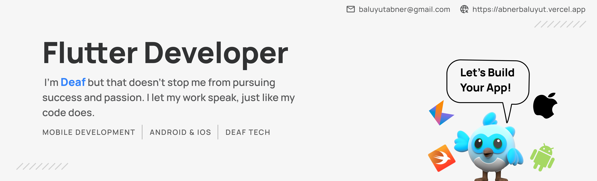

## 👋 Hi, I’m **Abner Baluyut**

I’m a **Flutter mobile developer** based in the Philippines 🇵🇭 with hands-on experience building, maintaining, and shipping **production-ready Android and iOS applications**. I focus on writing clean, scalable code and delivering apps that solve real business needs.

* 🔭 **Currently working on**

  * **Easelife** – A clinic-focused mobile app used for managing services and workflows
    [Google Play](https://play.google.com/store/apps/details?id=ph.easethetics.easentralized.easelife&hl=en) | [App Store](https://apps.apple.com/ph/app/easelife-1-step-to-perfection/id1638659132)
  * **Easemart** – A cross-border e-commerce app supporting international orders
    [Google Play](https://play.google.com/store/apps/details?id=ph.easethetics.easemart&hl=en) | [App Store](https://apps.apple.com/us/app/easemart-kr/id6443999042)
  * **EaseMonitoring** – A business monitoring companion app for clinics *(coming soon)*
* 🌱 **Currently learning:** Jetpack Compose & SwiftUI to deepen native development skills
* 💼 **Open to:** Freelance projects and full-time remote roles
* 🧠 **Portfolio, projects, and tech stack:**
  👉 [abnerbaluyut.vercel.app](https://abnerbaluyut.vercel.app/)

---

## 🚀 What I Do Best

* Build **cross-platform mobile apps** using Flutter
* Maintain and enhance **existing production apps**
* Translate designs into clean, responsive UI
* Integrate APIs, Firebase services, and third-party tools
* Collaborate closely with designers, backend, and product teams
* Write readable, maintainable code with long-term scalability in mind

---

## 🛠️ Skills & Tools

**Core Stack**
- Flutter (BLoC, GetX)
- Firebase (Auth, Firestore, FCM, Crashlytics)
- REST & GraphQL APIs

**Mobile Platforms**
- Android (Kotlin, Play Store releases)
- iOS (Swift, App Store releases)

**Tools & Workflow**
- Git / GitHub (branching, pull requests, code reviews)
- Manual build, testing, and release to Play Store & App Store
- Postman for API testing
- Figma for UI collaboration
- Debugging, bug fixing, and app maintenance

---

## 📌 Selected Highlights

* Shipped and maintained **multiple live apps** on Google Play and the App Store
* Experience handling **app updates, bug fixes, and performance improvements**
* Worked on apps used in **real business operations**, not just demos
* Comfortable working independently or as part of a distributed team

---

## 📫 Let’s Connect

> *Being Deaf doesn’t limit how I build software.
> I focus on clarity, quality, and results—letting my work speak for itself.*

---

